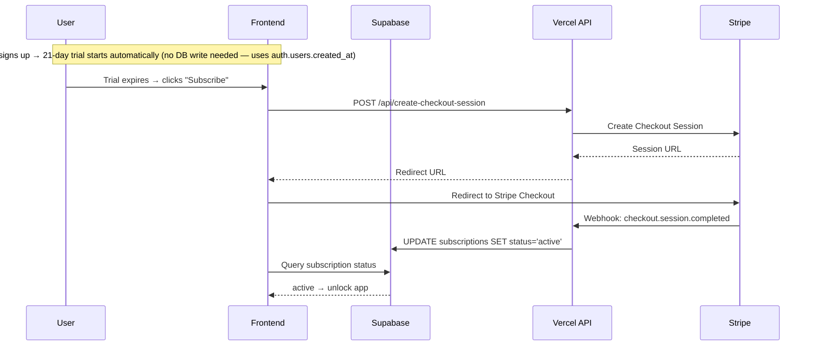

# Feature Gating / Pricing / Stripe Integration

Add a 21-day free trial for all new users, then require a paid subscription via Stripe to continue using TradeSharp. Two plans: **$10/month** or **$96/year** ($8/month equivalent — 17% savings).

## User Review Required

> [!IMPORTANT]
> **Pricing model**: Two plans, both with a 21-day free trial (no credit card required to start):
> - **Monthly**: $10/month
> - **Annual**: $96/year ($8/month — save 17%)
>
> Trial begins on the Supabase `auth.users.created_at` timestamp — so users who already signed up get 21 days from their original sign-up date.

> [!IMPORTANT]
> **Pricing display location**: Embedded as a section within the **existing landing page** (between the Score section and CTA), not a separate route. Two-plan toggle layout (Monthly / Annual) with the annual plan highlighted as the recommended option showing the per-month savings.

> [!WARNING]
> **Existing users**: Any users who signed up before Stripe goes live will also be subject to the 21-day trial window from their `created_at` date. If you want to grandfather existing users or give them a fresh 21-day window from the deployment date, let me know and I'll adjust the logic.

> [!IMPORTANT]
> **Stripe setup required (manual steps)**:
> 1. Create a [Stripe account](https://dashboard.stripe.com) (if not already)
> 2. Create a Product ("TradeSharp Pro") with **two prices** in the Stripe Dashboard:
>    - $10/month recurring → copy the Price ID
>    - $96/year recurring → copy the Price ID
> 3. Create a Stripe Webhook in the Dashboard pointing to `https://yourdomain.com/api/stripe-webhook` listening for events: `checkout.session.completed`, `customer.subscription.updated`, `customer.subscription.deleted`
> 4. Copy the **Webhook Signing Secret** → goes into env vars
> 5. Add these env vars to Vercel: `STRIPE_SECRET_KEY`, `STRIPE_PRICE_ID_MONTHLY`, `STRIPE_PRICE_ID_ANNUAL`, `STRIPE_WEBHOOK_SECRET`

---

## Architecture Overview



---

## Proposed Changes

### Database (Supabase)

#### [NEW] `subscriptions` table + migration SQL

New table to store subscription state. The trial is **not** stored here — it's computed from `auth.users.created_at`. This table only holds Stripe subscription data.

```sql
-- subscriptions table
create table if not exists subscriptions (
  id uuid default gen_random_uuid() primary key,
  user_id uuid references auth.users(id) on delete cascade not null unique,
  stripe_customer_id text,
  stripe_subscription_id text,
  status text not null default 'trialing',  -- 'trialing' | 'active' | 'canceled' | 'past_due'
  plan_interval text,                        -- 'month' | 'year' (from Stripe subscription)
  current_period_end timestamptz,
  cancel_at_period_end boolean default false,
  created_at timestamptz default now(),
  updated_at timestamptz default now()
);

alter table subscriptions enable row level security;

-- Users can read their own subscription
create policy "Users can view own subscription"
  on subscriptions for select using (auth.uid() = user_id);

-- Only service role can insert/update (from webhook API)
-- No insert/update policies for anon key — webhooks use service role
```

> [!NOTE]
> The webhook API will use the **Supabase service role key** (not the anon key) to write to the `subscriptions` table. This means no RLS insert/update policies are needed — the service role bypasses RLS.

---

### API Routes (Vercel Serverless)

#### [NEW] [create-checkout-session.js](file:///Users/dannychan/Desktop/tradesharpv2/api/create-checkout-session.js)

- Accepts authenticated user's JWT + `plan` parameter (`monthly` | `annual`) from the request body
- Verifies the user via Supabase
- Creates or retrieves a Stripe Customer (stores `stripe_customer_id` in `subscriptions` table)
- Selects the correct Stripe Price ID based on the `plan` parameter (`STRIPE_PRICE_ID_MONTHLY` or `STRIPE_PRICE_ID_ANNUAL`)
- Creates a Stripe Checkout Session in `subscription` mode
- Returns the checkout URL for the frontend to redirect to

#### [NEW] [stripe-webhook.js](file:///Users/dannychan/Desktop/tradesharpv2/api/stripe-webhook.js)

- Verifies Stripe webhook signature
- Handles events:
  - `checkout.session.completed` → upsert subscription record with `status: 'active'`
  - `customer.subscription.updated` → update status, `current_period_end`, `cancel_at_period_end`
  - `customer.subscription.deleted` → set `status: 'canceled'`
- Uses Supabase **service role** client to write

#### [NEW] [manage-subscription.js](file:///Users/dannychan/Desktop/tradesharpv2/api/manage-subscription.js)

- Creates a Stripe Customer Portal session so users can manage billing/cancel
- Returns the portal URL for redirect

---

### Frontend

#### [MODIFY] [LandingPage.jsx](file:///Users/dannychan/Desktop/tradesharpv2/src/pages/LandingPage.jsx)

Add a **Pricing section** between the Score section and the final CTA. Design:

- Section label chip: "PRICING"
- Headline: "One plan. Two ways to pay."
- **Monthly / Annual toggle** — pill-shaped toggle switcher, Annual side has a "Save 17%" badge
- Single glassmorphic pricing card centered, content updates based on toggle:
  - **Monthly selected**: "$10" / month
  - **Annual selected**: "$8" / month with "$96 billed annually" subtitle, plus a "BEST VALUE" chip
- Shared content on the card:
  - "21-day free trial included" tagline
  - Feature list (checkmarks): A+ Trade Checklist, Trade Journal & Analytics, TradeSharp Score, AI Performance Coach, Education Library, Mission Roadmap, Unlimited trades
  - CTA button: "Start Free Trial →" → navigates to `/login`
- Subtle footer note: "Cancel anytime. No contracts. No hidden fees."

#### [NEW] [useSubscription.js](file:///Users/dannychan/Desktop/tradesharpv2/src/hooks/useSubscription.js)

Custom React hook encapsulating all subscription logic:

```js
// Returns:
{
  loading: boolean,
  isTrialing: boolean,
  isActive: boolean,         // trial OR paid subscription
  trialDaysLeft: number,
  trialExpired: boolean,
  subscription: object|null, // raw row from subscriptions table
  planInterval: string|null, // 'month' | 'year' | null
  subscribe: (plan: 'monthly'|'annual') => void, // redirect to Stripe Checkout with selected plan
  manageSubscription: () => void, // redirect to Stripe Portal
}
```

Logic:
1. Fetch user's `created_at` from Supabase auth
2. Compute trial status: `trialDaysLeft = 21 - daysSince(created_at)`
3. Fetch subscription row from `subscriptions` table
4. `isActive = trialDaysLeft > 0 || subscription?.status === 'active'`

#### [MODIFY] [trader-roadmap-xp.jsx](file:///Users/dannychan/Desktop/tradesharpv2/trader-roadmap-xp.jsx)

Add subscription gating after the auth check:

1. Import and use `useSubscription` hook
2. After the existing `if (!user)` redirect check, add a **paywall screen** for expired trials:
   - If `!isActive` (trial expired AND no active subscription), render a full-screen paywall instead of the app
   - Paywall design: glassmorphic card with TradeSharp logo, "Your free trial has ended" messaging, Monthly/Annual toggle with both pricing options, "Subscribe Now" button, and "Manage Subscription" link (if they previously subscribed but canceled)
3. Add a **trial banner** at the top of the app when `isTrialing`:
   - Subtle banner: "🔓 Free trial — X days remaining" with an "Upgrade" link
   - Dismissible, but re-appears each session

#### [MODIFY] [vercel.json](file:///Users/dannychan/Desktop/tradesharpv2/vercel.json)

- Add the new API functions to the functions config
- Update CSP header to allow connections to `https://api.stripe.com` and `https://checkout.stripe.com`

#### [MODIFY] [package.json](file:///Users/dannychan/Desktop/tradesharpv2/package.json)

- Add `stripe` as a production dependency (for the API routes)

---

## Open Questions

> [!IMPORTANT]
> **Existing user handling**: Should users who already have accounts get the 21-day trial from their original sign-up date, or should everyone get a fresh 21 days from when this feature goes live? The current plan uses the original sign-up date (`auth.users.created_at`).

> [!IMPORTANT]
> **Stripe account**: Do you already have a Stripe account set up? If not, we'll need you to create one and set up the product/price before the integration can be tested end-to-end. I'll build everything so you just need to drop in the env vars.

> [!NOTE]
> **Annual plan**: ✅ Decided — $96/year ($8/month, 17% savings) alongside the $10/month plan. Both will be available from day one with a toggle on the landing page and paywall.

---

## Verification Plan

### Automated Tests
- Run `npm run build` to verify no build errors
- Test the new API routes locally with `vercel dev` against Stripe test mode
- Verify webhook signature validation works with Stripe CLI: `stripe listen --forward-to localhost:3000/api/stripe-webhook`

### Manual Verification
- Sign up as a new user → verify 21-day trial is active, trial banner shows correct days remaining
- Wait for trial to expire (or manually set `created_at` to 22 days ago in Supabase) → verify paywall appears
- Click "Subscribe" → verify redirect to Stripe Checkout
- Complete test payment → verify webhook fires and app unlocks
- Test the "Manage Subscription" portal link
- Verify the landing page pricing section looks premium and matches the existing design system
- Mobile responsiveness check for pricing section and paywall
